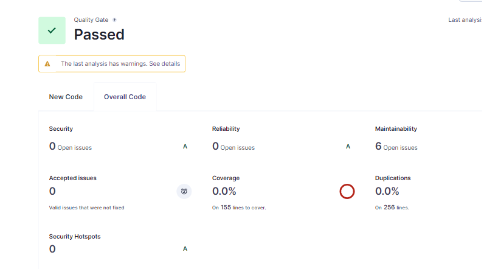

# Aplicación de Gestión de Tareas

Esta es una aplicación de gestión de tareas desarrollada en Python utilizando Streamlit para la interfaz de usuario y SQLAlchemy para la persistencia de datos. La aplicación permite a los usuarios gestionar sus tareas diarias de manera eficiente.

## Funcionalidades

1. **Agregar Tareas**: Permite al usuario agregar nuevas tareas con un título y una descripción.
2. **Listar Tareas**: Muestra todas las tareas agregadas con su estado (pendiente o completada).
3. **Marcar Tareas como Completadas**: Permite al usuario marcar una tarea como completada.
4. **Eliminar Tareas**: Permite al usuario eliminar tareas completadas.
5. **Guardar y Cargar Tareas**: Exporta las tareas a un archivo JSON e importa tareas desde el mismo archivo.
6. **Interfaz Gráfica**: Utiliza Streamlit para una interfaz de usuario sencilla e interactiva.

## Requisitos Técnicos

- Python 3.x
- Streamlit
- SQLAlchemy

## Instalación

1. **Clonar el repositorio**:
   ```bash
   git clone https://github.com/tu_usuario/tu_repositorio.git
   cd tu_repositorio
   ```

2. **Instalar las dependencias**:
   ```bash
   pip install streamlit sqlalchemy
   ```

3. **Ejecutar la aplicación**:
   ```bash
   streamlit run main.py
   ```

   Si encuentras problemas al ejecutar Streamlit, intenta con:
   ```bash
   python -m streamlit run main.py
   ```

## Uso

- **Agregar Tareas**: Completa el formulario con el título y la descripción de la tarea y presiona "Agregar Tarea".
- **Listar Tareas**: Las tareas se muestran automáticamente en la interfaz.
- **Marcar como Completada**: Haz clic en el botón "Completar" junto a la tarea.
- **Eliminar Tareas**: Haz clic en el botón "Eliminar" junto a la tarea.
- **Exportar/Importar Tareas**: Usa los botones de exportar e importar para manejar archivos JSON de tareas.

## Contribuciones

Las contribuciones son bienvenidas. Por favor, abre un issue o un pull request para discutir cualquier cambio que desees realizar.


## Uso de sonarScanner

como pueden ver el resultado que me dio el sonarScanner es el siguiente, para mas informacion dejare el pdf en la carpeta:
